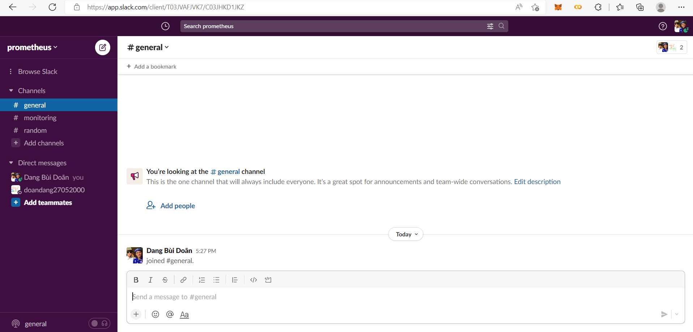
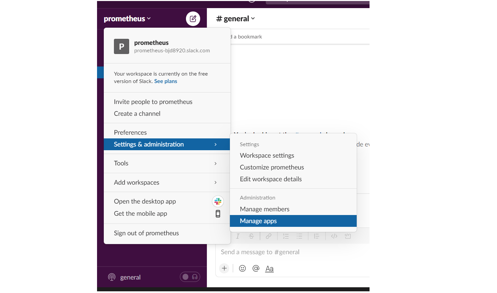
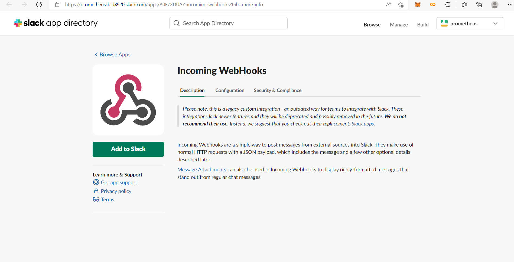
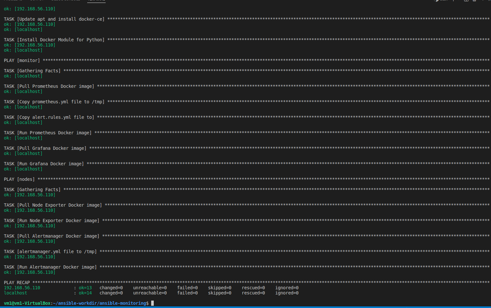

# Using Ansible to deploy Prometheus, Grafana and Node Exporter


Author: **Vo Minh Thien Long**

----        
## Table of contents     
[I. Prerequisites knowledge](#knowledge)
- [1. Ansible](#ansible)
- [2. Prometheus](#prometheus)
- [3. Node Exporter](#node-exporter)           
- [4. Grafana](#grafana)   

[II. Prerequisites system](#system)
- [1. Monitoring machine](#monitoring-machine)
- [2. Node machines](#node-machines)

[III. First set up](#setup)   
- [1. Install Ansible](#install-ansible)  
- [2. Configure Ansible](#configure-ansible)  
- [3. Create `host` inventory](#host-inventory)  
- [4. Create playbook](#create-playbook)  
- [5. Deploy](#deploy)

[IV. Applied Ansible Roles](#roles)
- [1. Overview](#roles-overview)
- [2. Ansible Galaxy](#ansible-galaxy)
- [3. Role `common`](#role-common)
- [4. Role `prometheus`](#role-prometheus)
- [5. Role `grafana`](#role-grafana)
- [6. Role `node-exporter`](#role-node-exporter)
- [7. Deploy](#roles-deploy)

[V. Applied `jinja2` template](#encountered-errors)
- [1. Overview](#jinja2-overview)
- [2. Role `common`](#jinja2-common)
- [3. Role `prometheus`](#jinja2-prometheus)
- [4. Role `grafana`](#jinja2-grafana)
- [5. Role `node-exporter`](#jinja2-node-exporter)
- [6. Deploy](#jinja2-deploy)

[VI. References](#references)

---- 

## I. Prerequisites knowledge
<a name='knowledge'></a> 

### 1. Ansible
<a name='ansible'></a> 

#### 1.1. Overview

**Ansible** is an `open-source` software **provisioning**, **configuration 
management**, and **application-deployment** tool enabling 
**infrastructure as code**. 

- Original author: **Michael DeHaan**
- Developer(s): Ansible Community / Ansible Inc. / **Red Hat Inc** (since October 2015)
- Initial release: **February 20, 2012**
- Written in: **Python, PowerShell, Shell, Ruby**
- Operating system: **Linux, Unix-like, MacOS, Windows**

<div align="center">
  
</div>

<div align="center">
  <i>Ansible logo.</i>
</div>

#### 1.2. Architecture

Ansible works by connecting to your nodes and pushing out small programs, 
called **Ansible modules** to them. These programs are written to be resource
models of the desired state of the system. 
Ansible then _executes_ these modules (over `SSH` by default), 
and _removes_ them when finished.

<div align="center">
  
</div>

<div align="center">
  <i>Ansible architecture.</i>
</div>

#### 1.3. Glossary

**Modules**

- Modules are the units of work that Ansible ships out to remote machines.
- Modules can be implemented in any language, including Perl, Bash, Ruby or Python. 
- Modules just have to return JSON. 
- Once modules are executed on remote machines, they are removed, so no long running daemons are used. 


**Host**

- A host is simply a remote machine that Ansible manages. 
- They can have individual variables assigned to them, and can also be organized in groups. 

**Playbooks**

- Playbooks are the language by which Ansible **orchestrates**, **configures**, **administers**, or **deploys systems**. 

**Inventory**

- A file (by default, Ansible uses a simple **INI** format) that describes Hosts and Groups 
in Ansible. 
- Inventory can also be provided via an Inventory Script.

**Roles**

- Roles are units of organization in Ansible. 
- Assigning a role to a group of hosts. 
- A role may include applying certain variable values, certain tasks, and certain handlers. 

**Task**

- Playbooks exist to run tasks. 
- Tasks combine an action (a module and its arguments) with a name. 
- Handlers are also tasks, but they are a special kind of task that do not run unless they are notified by name when a task reports an underlying change on a remote system.

### 2. Prometheus
<a name='prometheus'></a> 

**Prometheus** is an` open-source` **systems monitoring** and **alerting toolkit**. Prometheus collects and 
stores its metrics as time series data, i.e. metrics information is stored with the 
timestamp at which it was recorded, alongside optional key-value pairs called labels.

<div align="center">
  
</div>

<div align="center">
  <i>Prometheus logo.</i>
</div>

### 3. Node Exporter
<a name='node-exporter'></a> 

**Node Exporter** is a _Prometheus Exporter_ can **fetch statistics** from an application in the format 
used by that system, **convert those statistics** into `metrics` that Prometheus can utilize, 
and then expose them on a Prometheus-friendly URL. 

**Node Exporter** measures multiples `metrics` such as:

|   <!-- -->  | <!-- -->                                 |                                                                          
|-------------|------------------------------------------|
| **Memory**  | RAM Total, RAM Used, RAM Cache, RAM Free |
| **Disk**    | Disk Space, IOPS, Mounts                 |
| **CPU**     | CPU Load, CPU Memory Disk                | 
| **Network** | Network traffic, TCP flow, Connections   |

### 4. Grafana
<a name='grafana'></a> 

**Grafana** is a _multi-platform_ `open source` **analytics** and **interactive visualization** web application.
It provides charts, graphs, and alerts for the web when connected to supported data sources. 

**Grafana** is divided into a _front end_ and _back end_, written in `TypeScript` and `Go`, respectively.

As a visualization tool, **Grafana** is a popular component in **monitoring stacks**, 
often used in combination with time series databases such as  `Prometheus` and other data sources. 

<div align="center">
  
</div>

<div align="center">
  <i>Grafana logo.</i>
</div>

## I. Chuẩn bị
- Để có thể chạy **Prometheus + Alertmanager** với Ha high availability ta cần 2 node phân biệt là monitor và nodes. Trong bài báo cáo này, 2 node đều sử dụng HĐH ubuntu 20.04, 4G RAM và 64GB. 
- Ansible để deploy các phần mềm cần thiết.

## II. Cài đặt Prometheus + Exporter + Alertmanager + Grafana

### 1. Cài đặt Ansible
Đầu tiên ta chạy câu lệnh:
```
sudo apt update
```
Sau đó chạy các lệnh cài đặt các package cần thiết

```
sudo apt install software-properties-common
```

Tiếp đến ta dùng `add-apt-repository` để thêm **Ubuntu PPA**:
```
sudo add-apt-repository --yes --update ppa:ansible/ansible
```
Chạy câu lệnh cài đặt ansible:
```
sudo apt install ansible
```

### 2. Cấu hình Ansible

Đầu tiên ta tạo file ansible.cfg và cấu hình như sau:

```
[defaults]
host_key_checking = False
inventory = ./.hosts
```

  
### 3. Cấu hình inventory

Trong inventory ta chia làm 2 group: `monitor` and `nodes. Máy monitor sẽ là localhost và máy trạm sẽ là remote host.

Ta sẽ cấu hình file `.hosts` như sau:

```
[monitor]
localhost ansible_connection=local

[nodes]
192.168.56.110 ansible_ssh_user=vm1 ansible_ssh_pass
```

### 4. Xây dựng playbook

Playbook sẽ thực hiện các bước sau

- Install **Docker** cho toàn bộ
- Install **Prometheus** cho `monitor`.
- Install **Grafana** cho `monitor`.
- Install **Node Exporter** cho `nodes`.
- Install **Alertmanager** cho `nodes`.

Chi tiết các bước cài đặt như sao
#### 4.1. Install Docker
Ta đặt 'hosts:all' để có thể cài đặt docker cho toàn bộ các host.
Đầu tiên, ta cài đặt công cụ `aptitude` để giao tiếp với trình quản lý gói Linux và cài đặt các gói hệ thống cần thiết.

```yaml
- name: Install aptitude
  apt:
    name: aptitude
    state: latest
```

Tiếp đến ta cài đặt các package cần thiết:

```yaml
- name: Install required system packages
  apt:
    name:
      - apt-transport-https
      - ca-certificates
      - curl
      - software-properties-common
      - python3-pip
      - virtualenv
      - python3-setuptools
    state: latest
```

Thêm khóa GPG:

```yaml
- name: Add Docker GPG apt Key
  apt_key:
    url: https://download.docker.com/linux/ubuntu/gpg
    state: present
```
Tiếp đến ta download version mới nhất của docker:

```yaml
- name: Add Docker Repository
  apt_repository:
    repo: deb https://download.docker.com/linux/ubuntu focal stable
    state: present
```

 Cài đặt `docker-ce`:

```yaml
- name: Update apt and install docker-ce
  apt:
    name: docker-ce
    state: latest
```

Cuối cùng ta sử dụng 'pip' để cài đặt module cho python

```yaml
- name: Install Docker Module for Python
  pip:
    name: docker
```
#### 4.2. Install Prometheus

Ta đặt `host: monitor` để cài đặt promethues trên host

Trước tiên ta pull image về 
```yaml
- name: Pull Prometheus Docker image
  docker_image:
    name: prom/prometheus:latest
    source: pull
```
Set up cho file prometheus.yml

```yaml
global:
  scrape_interval: 15s

scrape_configs:
- job_name: prometheus
  static_configs:
  - targets:
    - 127.0.0.1:9090

- job_name: node
  static_configs:
  - targets: 
    - 192.168.56.110:9100

alerting:
  alertmanagers:
  - static_configs:
    - targets:
      #- localhost:9093
      - 192.168.56.110:9093

rule_files:
  - "/etc/prometheus/alert.rules.yml"
```
Copy file prometheus.yml vào /tmp

```yaml
- name: Copy alert.rules.yml file to 
    copy:
      src: alert.rules.yml
      dest: /tmp
```
Tiếp đến ta copy file alert.rules.yml để thêm các cảnh báo, chi tiết file sẽ được hướng dẫn ở phần sau.

```yaml
- name: Copy prometheus.yml file to /tmp
  copy:
    src: prometheus.yml
    dest: /tmp
```

Cuối cùng ta chạy image bằng docker trên cổng 9090
```yaml
- name: Run Prometheus Docker image
    docker_container:
      name: prometheus
      image: prom/prometheus:latest
      restart_policy: unless-stopped
      volumes: 
      - /tmp/prometheus.yml:/etc/prometheus/prometheus.yml
      - /tmp/alert.rules.yml:/etc/prometheus/alert.rules.yml
      command:
            - '--config.file=/etc/prometheus/prometheus.yml'
      ports:
      - "9090:9090"
```

#### 4.3. Install Grafana

Tương tự như với Prometheus ta cũng thực hiên pull image.

```yaml
- name: Pull Grafana Docker image
  docker_image:
    name: grafana/grafana-enterprise:latest 
    source: pull
```

Chạy container

```yaml
- name: Run Grafana Docker image
  docker_container:
    name: grafana
    image: grafana/grafana-enterprise:latest
    restart_policy: unless-stopped
    ports:
    - "3000:3000"
```


#### 4.4. Install Node Exporter

Tiếp đến cài đặt Node Exporter trên máy remote.

Thực hiện pull image:

```yaml
- name: Pull Node Exporter Docker image
  docker_image:
    name: prom/node-exporter:latest
    source: pull
```

Chạy container Node Exporter.

```yaml
- name: Run Node Exporter Docker image
  docker_container:
    name: node-exporter
    image: prom/node-exporter:latest
    restart_policy: unless-stopped
    ports: 
    - "9100:9100"
```

#### 4.5. Install Alertmanager
Để đảm bảo tính HA, ta cài Alertmanager trên máy remote.

Thực hiện pull image:

```yaml
- name: Pull Alertmanager Docker image
    docker_image:
      name: prom/alertmanager:latest
      source: pull
```

Copy file alertmanager.yml vào /tmp. Cấu hình của file sẽ được đề cập đến ở phần sau.

```yaml
- name: alertmanager.yml file to /tmp
    copy:
      src: alertmanager.yml
      dest: /tmp
```
Cuối cùng là chạy container.
```yaml
- name: Run Alertmanager Docker image
    docker_container:
      name: alertmanager
      image: prom/alertmanager:latest
      ports:
      - "9093:9093"
      restart_policy: unless-stopped
      volumes:
        - /tmp/alertmanager.yml:/alertmanager.yml
      command:
          - '--config.file=/alertmanager.yml'
```
#### 4.6. Thêm các cảnh báo
Các cảnh báo được thêm trong file alert.rules.yml, để file có thể chạy được ta chú ý thêm dòng lệnh.

```yaml
rule_files:
  - "/etc/prometheus/alert.rules.yml"
```
Tiếp đến ta định nghĩa các rule cần thiết đển monitoring host và container

```yaml
groups:
- name: alert.rules
  rules:
  - alert: InstanceDown
   # Condition for alerting
    expr: up == 0
    for: 1m
   # Annotation - additional informational labels to store more information
    annotations:
      title: 'Instance {{ $labels.instance }} down'
      description: '{{ $labels.instance }} of job {{ $labels.job }} has been down for more than 1 minute.'
   # Labels - additional labels to be attached to the alert
    labels:
        severity: 'critical'

  - alert: HostOutOfMemory
   # Condition for alerting
    expr: node_memory_MemAvailable / node_memory_MemTotal * 100 < 25
    for: 5m
   # Annotation - additional informational labels to store more information
    annotations:
      title: 'Host out of memory (instance {{ $labels.instance }})'
      description: 'Node memory is filling up (< 25% left)\n  VALUE = {{ $value }}\n  LABELS: {{ $labels }}'
   # Labels - additional labels to be attached to the alert
    labels:
        severity: 'warning'

  - alert: HostHighCpuLoad
   # Condition for alerting
    expr: (sum by (instance) (irate(node_cpu{job="node_exporter_metrics",mode="idle"}[5m]))) > 80
    for: 5m
   # Annotation - additional informational labels to store more information
    annotations:
      title: 'Host high CPU load (instance {{ $labels.instance }})'
      description: 'CPU load is > 80%\n  VALUE = {{ $value }}\n  LABELS: {{ $labels }}'
   # Labels - additional labels to be attached to the alert
    labels:
        severity: 'warning'

  - alert: HostOutOfDiskSpace
   # Condition for alerting
    expr: (node_filesystem_avail{mountpoint="/"}  * 100) / node_filesystem_size{mountpoint="/"} < 50
    for: 5m
   # Annotation - additional informational labels to store more information
    annotations:
      title: 'Host out of disk space (instance {{ $labels.instance }})'
      description: 'Disk is almost full (< 50% left)\n  VALUE = {{ $value }}\n  LABELS: {{ $labels }}'
   # Labels - additional labels to be attached to the alert
    labels:
        severity: 'warning'
  
    # This rule can be very noisy in dynamic infra with legitimate container start/stop/deployment.
  - alert: ContainerKilled
    expr: time() - container_last_seen > 60
    for: 0m
    labels:
      severity: warning
    annotations:
      summary: Container killed (instance {{ $labels.instance }})
      description: "A container has disappeared\n  VALUE = {{ $value }}\n  LABELS = {{ $labels }}"


  #Container CPU usage is above 80% 
  - alert: ContainerCpuUsage
    expr: (sum(rate(container_cpu_usage_seconds_total{name!=""}[3m])) BY (instance, name) * 100) > 80
    for: 2m
    labels:
      severity: warning
    annotations:
      summary: Container CPU usage (instance {{ $labels.instance }})
      description: "Container CPU usage is above 80%\n  VALUE = {{ $value }}\n  LABELS = {{ $labels }}"
  
    # Container Memory usage
  - alert: ContainerMemoryUsage
    expr: (sum(container_memory_working_set_bytes{name!=""}) BY (instance, name) / sum(container_spec_memory_limit_bytes > 0) BY (instance, name) * 100) > 80
    for: 2m
    labels:
      severity: warning
    annotations:
      summary: Container Memory usage (instance {{ $labels.instance }})
      description: "Container Memory usage is above 80%\n  VALUE = {{ $value }}\n  LABELS = {{ $labels }}"
```
Ta thêm một vài rules như trên.

#### 4.7 Đẩy cảnh báo lên slack
Đầu tiên ta tạo tài khoản slack và đăng nhập vào.



Tiếp đến ta vào Manage app. 



Tìm và thêm Incoming WebHooks. Lấy API URL để thêm vào alertmanager.



Tiếp đến ta cấu hình Alertmanager như sau.

```yaml
global:
  resolve_timeout: 1m

route:
  group_by: ['alertname']
  group_wait: 10s
  group_interval: 10s
  repeat_interval: 1h
  receiver: 'slack-notifications'
receivers:
- name: 'slack-notifications'
  slack_configs:
  - api_url: "your url"
    channel: "your channel name"
    send_resolved: true
    
inhibit_rules:
  - source_match:
      severity: 'critical'
    target_match:
      severity: 'warning'
    equal: ['alertname', 'dev', 'instance']

```
Với 'api-url' lấy từ Incoming WebHooks.

### 5. Deploy

#### 5.1.  Chạy playbook
Ta ping đến các hosts kiểm tra

```
ansible -i hosts all -m ping
```


Ta có`./playbook.yml` file sẽ như sau:

```yaml
---
- hosts: all
  become: true
  tasks:
  - name: Install aptitude
    apt:
      name: aptitude
      state: latest

  - name: Install required system packages
    apt:
      name:
        - apt-transport-https
        - ca-certificates
        - curl
        - software-properties-common
        - python3-pip
        - virtualenv
        - python3-setuptools
      state: latest

  - name: Add Docker GPG apt Key
    apt_key:
      url: https://download.docker.com/linux/ubuntu/gpg
      state: present

  - name: Add Docker Repository
    apt_repository:
      repo: deb https://download.docker.com/linux/ubuntu focal stable
      state: present

      
  - name: Update apt and install docker-ce
    apt:
      name: docker-ce
      state: latest

  - name: Install Docker Module for Python
    pip:
      name: docker
      
- hosts: monitor
  become: true
  tasks:
  - name: Pull Prometheus Docker image
    docker_image:
      name: prom/prometheus:latest
      source: pull
    
  - name: Copy prometheus.yml file to /tmp
    copy:
      src: prometheus.yml
      dest: /tmp
  
  - name: Copy alert.rules.yml file to 
    copy:
      src: alert.rules.yml
      dest: /tmp

  - name: Run Prometheus Docker image
    docker_container:
      name: prometheus
      image: prom/prometheus:latest
      restart_policy: unless-stopped
      volumes: 
      - /tmp/prometheus.yml:/etc/prometheus/prometheus.yml
      - /tmp/alert.rules.yml:/etc/prometheus/alert.rules.yml
      command:
            - '--config.file=/etc/prometheus/prometheus.yml'
      ports:
      - "9090:9090"

  - name: Pull Grafana Docker image
    docker_image:
      name: grafana/grafana-enterprise
      source: pull
    
  - name: Run Grafana Docker image
    docker_container:
      name: grafana
      image: grafana/grafana-enterprise
      restart_policy: unless-stopped
      ports:
      - "3000:3000"
    
- hosts: nodes
  tasks:
  - name: Pull Node Exporter Docker image
    docker_image:
      name: prom/node-exporter:latest
      source: pull
    
  - name: Run Node Exporter Docker image
    docker_container:
      name: node-exporter
      image: prom/node-exporter:latest
      restart_policy: unless-stopped
      ports: 
      - "9100:9100"

  - name: Pull Alertmanager Docker image
    docker_image:
      name: prom/alertmanager:latest
      source: pull

  - name: alertmanager.yml file to /tmp
    copy:
      src: alertmanager.yml
      dest: /tmp

  - name: Run Alertmanager Docker image
    docker_container:
      name: alertmanager
      image: prom/alertmanager:latest
      ports:
      - "9093:9093"
      restart_policy: unless-stopped
      volumes:
        - /tmp/alertmanager.yml:/alertmanager.yml
      command:
          - '--config.file=/alertmanager.yml'
```

Chạy playbook bằng command:

```shell
ansible-playbook -i .hosts  playbook.yml
```



#### 5.3. Using Prometheus

Go to URL: `localhost:9090` to use **Prometheus**. You can use this [website](https://prometheus.io/docs/introduction/overview/) to learn how to
use **Prometheus**.

<div align="center">
  
</div>

<div align="center">
  <i>Execute an expression in Prometheus.</i>
</div>

Go to `Status` > `Targets` to check status of the targets.

<div align="center">
  
</div>

<div align="center">
  <i>Check targets status in Prometheus.</i>
</div>

#### 5.4. Using Grafana

Go to URL: `localhost:3000` to use **Grafana**. After that, login with default username `admin` and
default password `admin`. Then change it to your new password.

<div align="center">
  
</div>

<div align="center">
  <i>Login and set new password.</i>
</div>

Then, add a **Prometheus** data source to **Grafana**. Check this [article](https://grafana.com/docs/grafana/latest/datasources/add-a-data-source/)
to know how to do it.

After adding **Data sources**, we will use dashboard [Node Exporter Full](https://grafana.com/grafana/dashboards/1860). You
can follow this [article](https://grafana.com/docs/grafana/latest/dashboards/export-import/) 
to know how to import a dashboard into **Grafana**.

<div align="center">
  
</div>

<div align="center">
  <i>Node Exporter dashboard for 13.51.200.49.</i>
</div>

<div align="center">
  
</div>

<div align="center">
  <i>Node Exporter for 16.171.0.129.</i>
</div>

## VI. References

[1] [Ansible website](https://www.ansible.com/)

[2] [Prometheus website](https://prometheus.io/)

[3] [Grafana website](https://grafana.com/)

[4] [Install Ansible](https://www.digitalocean.com/community/tutorials/how-to-install-and-configure-ansible-on-ubuntu-20-04)

[5] [Install Docker by Ansible](https://www.digitalocean.com/community/tutorials/how-to-use-ansible-to-install-and-set-up-docker-on-ubuntu-20-04)

[6] [Ansible Galaxy website](https://galaxy.ansible.com/)

[7] [Example Ansible](https://github.com/ansible/ansible-examples)
