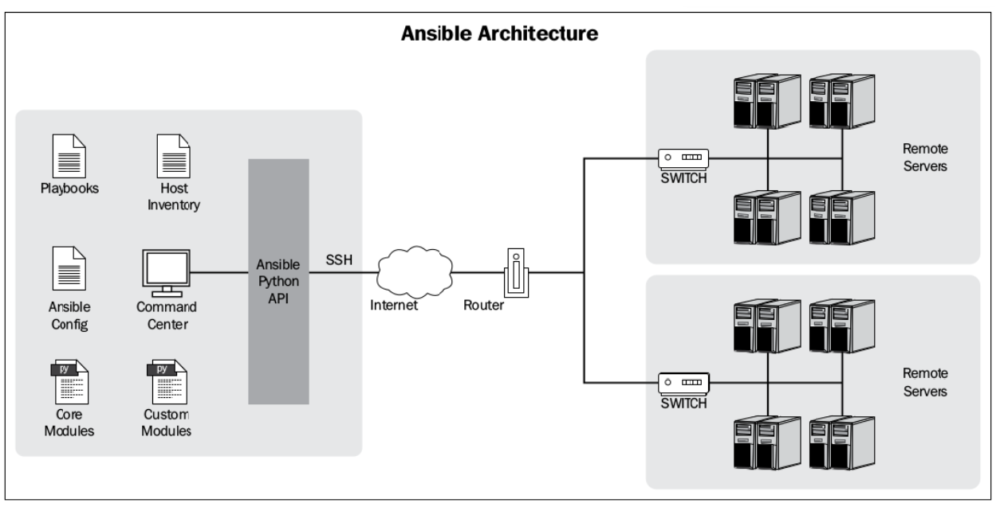

# **Documentation for Ansible 2 (2.4)**

-----
# Mục lục

- [1. Lịch sử IT automation](#history_it_automation)
	* [1.1 IT automation](#it_automation)
	* [1.2 Types of IT automation](#types_of_it_automation)
- [2. Giới thiệu về Ansible](#introduce_ansible)
	* [2.1 Ansible là gì](#what_is_ansible)
	* [2.2 Install Ansible](#install_ansible)
	* [2.3 Getting started](#getting_started)
	* [2.4 Ansible architecture và configuration](#ansible_architecture_and_configuration)
- [3. Playbooks](#playbook)
	* [3.1 Các khái niệm và ví dụ về playbook](#concept_and_introduce_playbook)
	* [3.2 Tính Idempotency của playbook](#idempotency_of_playbook)
	* [3.3 Handler trong playbook](#handler)
- [4. Invetory file](#inventory_file)
	* [4.1 Inventory file là gì](#what_is_inventory_file)
	* [4.2 Các option config trong inventory file](#inventory_options)
	* [4.3 Inventory groups](#inventory_group)
- [5. Include statements](#include_statement)
	* [5.1 Task include với Play include](#task_vs_play_include)
	* [5.2 Dynamic include](#dynamic_include)
- [6. Playbook role](#playbook_roles)
	* [6.1 Ansible galaxy](#ansible_galazy)
	* [6.2 Cấu trúc của role](#struct_of_roles)
	* [6.3 Thực hành với roles trong ansible](#practice_with_roles)
- [7. Variables](#variable)
	* [7.1 Variables trong playbook](#varibales_in_playbook)
	* [7.2 Registering variable](#registering_variable)
- [8. Security management](#security_management)
- [Tài liệu tham khảo](#references)

-------

<a name="history_it_automation"></a>
## **1. Mở đầu**

Vào những thời gian đầu của IT, có rất ít các servers và cần rất nhiều sysadmin để quản trị những server, thường ít nhất là 2 sysamdin cho mỗi server. Và việc mà các sysadmin phải làm như cài đặt phần mềm, nâng cấp version hay thay đổi các file config đều được thực hiện một cách thủ công. Do đó, việc quản lý tốn rất nhiều công sức và thường dễ xảy ra lỗi, vì vậy nhiều sysadmin đã bắt đầu dùng các scripts để giúp họ dễ dàng quản lý servers hơn. Nhưng các script này vẫn khá phức tạp và được tổ chức chưa tốt.

Khi công nghệ phát triển, các servers cũng trở nên tin cậy, ít lỗi hơn, và dễ dàng để quản lý hơn, các data center phát triển rất nhiều do nhu cầu của các công ty. Và để tốn ít chi phí, các công ty đã sử dụng virtualization, tạo ra hàng loạt các servers giống nhau. Vì vậy, mỗi sysadmin phải quản lý rất nhiều servers cùng lúc, nên cần phải có sự xuất hiện của các **configuration management tools** để thay thế cho các scripts đã được sử dụng trước đó.

CFEngine là tool quản lý cấu hình đầu tiên từ năm 1990, và hiện tại có rất nhiều tools khác hiệu quả và dễ sử dụng hơn như: Puppet, Chef, Salt và Ansible. Sau đây ta sẽ đi tìm hiểu về Ansible.


<a name="introduce_ansible"></a>
## **2. Ansible**

<a name="what_is_ansible"></a>
### **2.1 Ansible là gì**
Ansible là 1 agent-less IT automation tool được phát triển bởi ***Michael DeHaan*** năm 2012. Ansible được tạo ra với mục đích là: minimal, consistent, secure, highly reliable and easy to learn.

Ansible chủ yếu chạy trong chế độ push sử dụng SSH, nghĩa là ta sẽ push các configurations từ server tới các agent. Nhưng ta cũng có thể chạy ansible sử dụng **ansible-pull**, nghĩa là ta có thể cài đặt ansible lên mỗi agent, sau đó download các playbook từ server về và chạy khi có 1 số lượng lớn các máy tính (số lượng lớn này là bao nhiêu thì tùy thuộc, nhưng ở đây là nhiều hơn 500 máy)  và các updates cần thực hiện song song.

<a name="why_use_ansible"></a>
### **2.2 Lý do sử dụng Ansible**
Dưới đây là một số lý do quan trọng để sử dụng ```Ansible```, chẳng hạn như:
- ```Ansible``` được sử dụng miễn phí bởi tất cả mọi người.
- ```Ansible``` rất nhất quán và nhẹ và không có bất kỳ ràng buộc nào liên quan đến hệ điều hành hoặc phần cứng cơ bản.
- ```Ansible``` rất an toàn do khả năng không cần tác nhân và các tính năng bảo mật SSH mở.
- ```Ansible``` không cần bất kỳ kỹ năng quản trị hệ thống đặc biệt nào để cài đặt và sử dụng nó.
- ```Ansible``` có một đường cong học tập trơn tru được xác định bởi tài liệu toàn diện và cấu trúc và cấu hình dễ học.
- Tính mô-đun của nó liên quan đến các plugin, kho, mô-đun và sách phát làm cho người bạn đồng hành hoàn hảo của ```Ansible``` điều phối các môi trường rộng lớn.


<a name="component_ansible"></a>
### **2.3 Một số thành phần quan trọng trong Ansible**
- ```Ansible Server``` là nơi mà Ansible được cài đặt và từ đó tất cả các tác vụ và playbook sẽ được thực thi.
- ```Modules``` Ansible có rất nhiều module, ví dụ như moduel yum là module dùng để cài đặt các gói phần mềm qua yum. Ansible hiện có hơn ….2000 module để thực hiện nhiều tác vụ khác nhau, bạn cũng có thể tự viết thêm các module của mình nếu muốn.
- ```Task``` Một block ghi tác vụ cần thực hiện trong playbook và các thông số liên quan. Ví dụ 1 playbook có thể chứa 2 task là: yum update và yum install vim.
- ```Role``` là cơ chế chính giúp ta chia 1 playbook phức tạp ra các phần nhỏ hơn để dễ dàng viết cũng như tái sử dụng.
- ```Fact``` Thông tin của những máy được Ansible điều khiển, cụ thể là thông tin về OS, network, system…
- ```Inventory``` là file chứa các thông tin về hosts mà ta sẽ thực hiện các task trên đó, file hosts ta đang làm việc chính là 1 inventory file.
- ```Play``` là sự thực thi của playbook.
- ```Handler``` có chức năng giống như 1 task nhưng chỉ xảy ra khi có điều kiện nào đó.
- ```Notifier` Phần được quy cho một tác vụ gọi một trình xử lý nếu kết quả đầu ra bị thay đổi.
- ```Tag``` là tên được đặt cho một task có thể được sử dụng sau này để chỉ đưa ra task hoặc nhóm công việc cụ thể đó.


<a name="ansible_architecture_and_configuration"></a>
#### **2.4 Kiến trúc và cấu hình Ansible**



Trong hình trên cho ta thấy ý tưở

Trong trường hợp bạn cài ansible thông qua repo trên github thì file **ansible.cfg** sẽ nằm trong thư mục maf bạn đã clone Ansible repository về.

Bây giờ ta cùng tìm hểu 2 cách để configuration ansible, đó là dùng các biến môi trường và sử dụng file ansible.cfg.

**Config sử dụng các biên môi trường**
Ta có thể sử dụng hầu hết các configuration parameters trực tiếp thông qua các biên môi trường bằng cách thêm tiền tố **ANSIBLE_** ở đầu mỗi parameter (tên parameters phải là chữ hoa). Ví dụ như:

```sh
$ export ANSIBLE_SUDO_USER=root
```
Bây giờ, biến **ANSIBLE_SUDO_USER** có thể được sử dụng như là 1 phần của các playbook.

**Configuration sử dụng ansible.cfg**

Ansible có rất nhiều các configuration parameters, nhưng ta sẽ không đề cập đến tất cả mà chỉ đề cập tới các paramerter hay được sử dụng dưới đây:

- **hostfile**: chỉ ra đường dẫn của inventory file. 
- **library**: bất cứ khi nào ta yêu cầu ansible thực hiện 1 hành động nào đó,  dù cho đó là 1 hành động trên local hay tới 1 remote server, thì ansible cũng đều phải sử dụng 1 module nào đó để thực hiện. Parameter **library** sẽ chỉ tới đường dẫn của thư mục chứa các Ansible module. Ví dụ như: `library = /usr/share/ansible`.
- **forks**: số lượng process mặc định mà ta muốn Ansible thực hện song song, mặc định `forks=5`, có nghĩa là nếu ta muốn thực thi 1 task trên 10 remote servers thì ansible sẽ sinh ra 5 process để yêu cầu thực hiện task trên 5 remote servers cùng lúc, còn 5 servers còn lại sẽ phải đợi khi process yêu cầu thực hiện task được giải phóng thì ansible mới thực hiện tiếp task đó trên các server còn lại.
- **sudo_user**: chỉ định user mặc định ***should be used against the issued commands***.
- **remote_port**: sử dụng để chỉ định port cho SSH connection, mặc định là 22.
- **host_key_checking**: được dùng để disable việc kiểm tra SSH host key, mặc định là True.
- **timeout**: là giá trị cho timeout của SSH connection, mặc định là 60s.
- **log_path**: theo mặc định thì ansible không log lại gì, nhưng nếu ta muốn đưa output của Ansible vào 1 logfile thì ta có thể sử dụng parameter **log_path** chỉ tới đường dẫn của file mà ta muốn lưu log.

<a name="Luồng xử lý trong Ansible"></a>
## **3. Luồng xử lý trong Ansible**

<a name="human"></a>
### **3.1 Người quản trị**
Nhìn vào biểu đồ trên, bắt đầu từ trái qua phải, đầu tiên ta có thể thấy người quản trị có thể thông qua CLI để tương tác với Ansible. 
Giao diện dòng lệnh có hai cách tiếp cận khác nhau: Chúng ta có thể gửi lệnh từ dòng lệnh bằng cách sử dụng tệp thực thi ansible và đó được gọi là tương tác Ad-hoc. Cách tiếp cận thứ hai là sử dụng playbook, là tệp YML có chứa hướng dẫn mà con người có thể đọc được để thực hiện các tác vụ trên máy chủ hoặc nhóm máy chủ mong muốn khi gọi playbook và chúng tôi sẽ sử dụng tệp thực thi ansible-playbook.

<a name="playbook"></a>
### **3.2 Playbook**

Như đã giới thiệu ở trên playbook dưới dạng yaml có cú pháp thực hiện các tasks. mức độ cơ bản, 1 task đơn giản chỉ là 1 lời gọi tới 1 ansible module. Modules (còn được gọi là 'task plugins' hay 'library plugins') là nơi thực hiện các công việc thực sự trong ansible, chúng là những gì được thực hiện trong mỗi playbook task.
Hầu hết module đều được viết bằng python, mỗi module sẽ có các tham số truyền vào là khác nhau, và hầu như tất cả các module đều có tham số theo dạng key=value, các tham số cách nhau bởi dấu cách. Ngoài ra cũng có 1 số module không có tham số như ping...


<a name="Ansible"></a>
#### **3.2 Tính Idempotency của playbook**

Giống như đa phần các phần mềm quản lý cấu hình tập trung khác. Ansible có 2 loại server là control machine và node. Control machine là máy có trách nhiệm quản lý các node con trong hệ thống. Đây cũng là máy lưu trữ các thông tin về các node, playbook và các script cần dùng để deploy trên các node khác qua giao thức SSH.
Để quản lý các node, ansible sẽ thực hiện các bước sau:
1. Generate các task ra thành 1 Python script để thực hiện  ( trên thực tế cso thể
2. Tiếp đến thông qua Python API và giao thức SSH, đoạn scripts đó được gửi qua internet đến network và tới các host trong group được config 
3. Thực hiện script trên tất cả các host trong group
4.  Chờ cho tới khi script được thực hiện xong trên tất cả các host.


<a name="references"></a>
## **Tài liệu tham khảo**

------
1. [Ansible: From Beginner to Pro - Michael Heap](#)
2. [Learning Ansible 2 - Fabio Alessandro Locati](#)
3. [Ansible: Up and Running - Lorin Hochstein](#)
4. [Ansible documentation](http://docs.ansible.com/ansible/latest/index.html)

------
